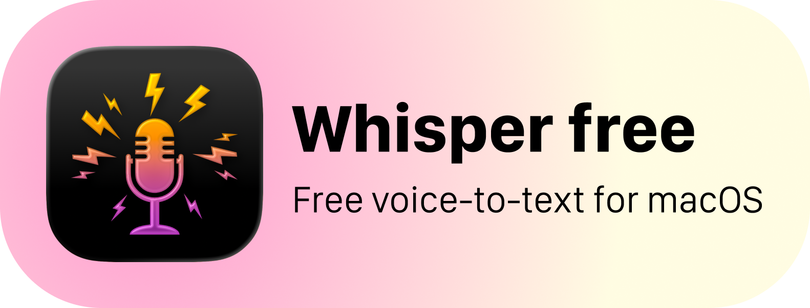

<p align="center">
  
</p>

**[English](#english)** · **[Русский](#русский)**

---

<a id="english"></a>

## English

Free open-source alternative to [SuperWhisper](https://superwhisper.com/) for macOS.  
Voice → text, locally via [whisper.cpp](https://github.com/ggerganov/whisper.cpp) or via OpenAI Whisper API. Result is automatically inserted into the active application.

### What it does

- Lives in the menu bar, triggered by a global hotkey (default `⌥ Space`)
- Transcribes speech locally (whisper.cpp, GPU/NPU) or via cloud (OpenAI)
- Auto-inserts the result into the currently focused app (paste or direct typing)
- 4 built-in modes: Dictation, Email, Code, Notes + custom modes
- AI post-processing via OpenAI or Perplexity (formatting, cleanup)
- Full transcription history
- 18 languages supported (auto-detect or manual selection)

### System Requirements

| Parameter | Minimum | Recommended |
|---|---|---|
| macOS | 14.0 (Sonoma) | 15.0+ |
| Architecture | Apple Silicon (arm64) | Apple Silicon |
| RAM | 8 GB | 16+ GB (for larger models) |
| Disk | ~200 MB (app + base model) | ~3 GB (large model) |
| Xcode CLI Tools | Required | — |
| Homebrew | Required | — |

> **Apple Silicon only.** Intel Macs are not supported — whisper.cpp is built for arm64.

### Whisper Models

| Model | Size | Quality | Speed | Min RAM |
|---|---|---|---|---|
| Tiny | ~75 MB | ★☆☆☆☆ | ⚡⚡⚡ | 8 GB |
| Base | ~140 MB | ★★☆☆☆ | ⚡⚡⚡ | 8 GB |
| Small | ~460 MB | ★★★☆☆ | ⚡⚡ | 8 GB |
| Medium | ~1.5 GB | ★★★★☆ | ⚡⚡ | 16 GB |
| Large v3 Turbo | ~1.6 GB | ★★★★☆ | ⚡⚡ | 16 GB |
| Large v3 | ~3.1 GB | ★★★★★ | ⚡ | 32 GB |

The model is auto-selected on first launch based on available RAM.  
Can be changed in Settings.

### Installation

#### Option 1: Download DMG

Download the latest `WhisperFree.dmg` from [Releases](https://github.com/iddictive/Whisper-Free/releases).

#### Option 2: Build from source

```bash
git clone https://github.com/iddictive/Whisper-Free.git
cd Whisper-Free
make install
```

`make install` handles everything automatically:
1. Checks macOS version and Xcode CLI Tools
2. Installs Homebrew (if missing)
3. Installs whisper-cpp
4. Downloads the Base model (~140 MB)
5. Builds the application
6. Creates `WhisperFree.app`

### Manual build

```bash
swift build -c release
make app
open WhisperFree.app
```

### First launch

1. Grant **Accessibility** permission (System Settings → Privacy & Security → Accessibility)
2. Grant **Microphone** permission
3. For Cloud mode or AI post-processing — enter your OpenAI API key in Settings

### Hotkeys

| Action | Key |
|---|---|
| Record / stop | `⌥ Space` (configurable) |
| Cancel recording | `Esc` |

### Recording modes

- **Hold** — hold the key, release to transcribe
- **Toggle** — press to start, press again to stop
- **Push to Talk** — hold for 300ms+, release to transcribe

### License

MIT

---

<a id="русский"></a>

## Русский

Бесплатная open-source альтернатива [SuperWhisper](https://superwhisper.com/) для macOS.  
Голос → текст, локально через [whisper.cpp](https://github.com/ggerganov/whisper.cpp) или через OpenAI Whisper API. Результат автоматически вставляется в активное приложение.

### Что это делает

- Живёт в menu bar, работает по горячей клавише (по умолчанию `⌥ Space`)
- Распознаёт речь локально (whisper.cpp, GPU/NPU) или через облако (OpenAI)
- Автоматически вставляет результат в текущее приложение (paste или прямой набор)
- 4 встроенных режима: Dictation, Email, Code, Notes + пользовательские
- AI-постобработка через OpenAI или Perplexity (форматирование, очистка)
- История всех транскрипций
- Поддержка 18 языков (авто-определение или ручной выбор)

### Системные требования

| Параметр | Минимум | Рекомендуется |
|---|---|---|
| macOS | 14.0 (Sonoma) | 15.0+ |
| Архитектура | Apple Silicon (arm64) | Apple Silicon |
| RAM | 8 GB | 16 GB+ (для больших моделей) |
| Диск | ~200 MB (приложение + базовая модель) | ~3 GB (large модель) |
| Xcode CLI Tools | Обязательно | — |
| Homebrew | Обязательно | — |

> **Apple Silicon only.** Intel Mac не поддерживается — whisper.cpp собирается под arm64.

### Модели Whisper

| Модель | Размер | Качество | Скорость | Мин. RAM |
|---|---|---|---|---|
| Tiny | ~75 MB | ★☆☆☆☆ | ⚡⚡⚡ | 8 GB |
| Base | ~140 MB | ★★☆☆☆ | ⚡⚡⚡ | 8 GB |
| Small | ~460 MB | ★★★☆☆ | ⚡⚡ | 8 GB |
| Medium | ~1.5 GB | ★★★★☆ | ⚡⚡ | 16 GB |
| Large v3 Turbo | ~1.6 GB | ★★★★☆ | ⚡⚡ | 16 GB |
| Large v3 | ~3.1 GB | ★★★★★ | ⚡ | 32 GB |

Модель выбирается автоматически при первом запуске в зависимости от доступной RAM.  
Можно переключить в Settings.

### Установка

#### Вариант 1: Скачать DMG

Скачать `WhisperFree.dmg` со страницы [Releases](https://github.com/iddictive/Whisper-Free/releases).

#### Вариант 2: Собрать из исходников

```bash
git clone https://github.com/iddictive/Whisper-Free.git
cd Whisper-Free
make install
```

`make install` выполнит всё автоматически:
1. Проверит macOS и Xcode CLI Tools
2. Установит Homebrew (если нет)
3. Установит whisper-cpp
4. Скачает модель Base (~140 MB)
5. Соберёт приложение
6. Создаст `WhisperFree.app`

### Ручная сборка

```bash
swift build -c release
make app
open WhisperFree.app
```

### Первый запуск

1. Разрешить **Accessibility** (System Settings → Privacy & Security → Accessibility)
2. Разрешить **Microphone**
3. Если нужен Cloud режим или AI-постобработка — ввести OpenAI API key в Settings

### Горячие клавиши

| Действие | Клавиша |
|---|---|
| Запись / стоп | `⌥ Space` (настраивается) |
| Отмена записи | `Esc` |

### Режимы записи

- **Hold** — удерживайте клавишу, отпустите для транскрипции
- **Toggle** — нажмите для начала, нажмите снова для остановки
- **Push to Talk** — удерживайте 300ms+, отпустите для транскрипции

### Лицензия

MIT
