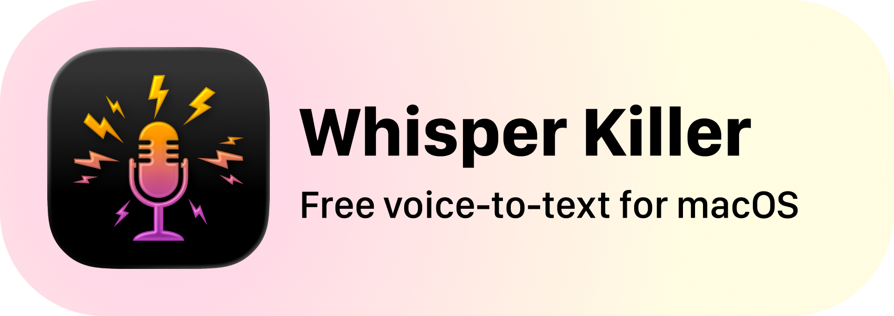
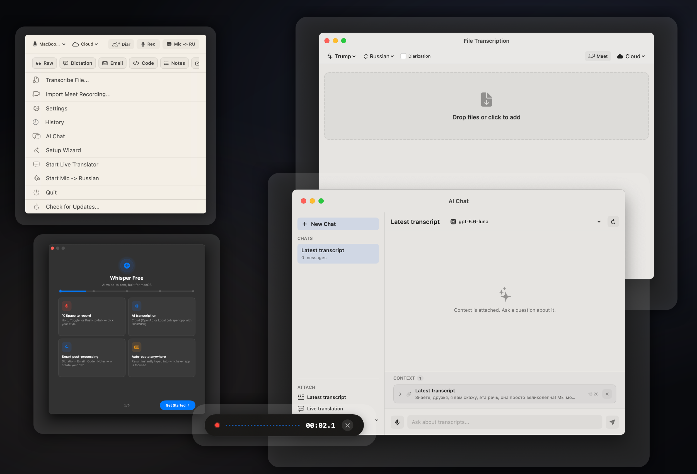

# WhisperKiller

<p align="center">
  
</p>

<p align="center">
  <a href="#english">English</a> • <a href="#russian">Русский</a>
</p>

## Interface Tour

<p align="center">
  <a href="assets/interface-collage.png">
    
  </a>
</p>

---

<a id="english"></a>

## 🇺🇸 English

> macOS menu bar app for dictation, file transcription, transcript cleanup, and meeting summaries.

WhisperKiller turns a global shortcut into speech-to-text for daily writing and audio files. It can run locally through `whisper.cpp`, use OpenAI Whisper for cloud transcription, or use GigaAM for Russian ASR experiments. Cloud features use your own OpenAI API key.

Current release: **3.43**

## What It Handles

- Dictation from the menu bar with a global shortcut. Default: `Option + Space`.
- Hold-to-record, toggle recording, and push-to-talk modes.
- Audio and video file transcription through a drag-and-drop queue.
- File range trimming before transcription.
- Result insertion into the active app by paste, typing, or paste-and-enter.
- Transcript cleanup modes for dictation, email, code, notes, and custom prompts.
- Speaker diarization and summaries when an OpenAI key is available.
- Searchable history with raw text, processed text, summaries, playback, and Finder reveal.
- Live Translator for microphone or system audio.
- Google Meet recording import from Drive when Google OAuth is configured.

## Interface Surfaces

- **Menu bar:** recording controls, active mode, quick access to history and file transcription.
- **File transcription:** queue, drag-and-drop import, range selection, per-file progress.
- **Settings:** engine choice, models, language, text insertion, OpenAI/GigaAM/Ollama/Google integrations.
- **History:** searchable transcripts with raw output, processed text, summary, audio playback, and file reveal.

## Engines

| Engine | Use it for | Requirements |
| --- | --- | --- |
| Local Whisper | Offline dictation and file transcription | `brew install whisper-cpp` plus a downloaded Whisper model |
| OpenAI Whisper | Cloud transcription runs | OpenAI API key |
| GigaAM Russian | Experimental Russian ASR | Python runtime and GigaAM packages |
| Ollama follow-up | Local follow-up summaries where configured | Ollama installed locally |

## Languages

The app exposes 17 selectable languages plus auto-detect: English, Russian, Spanish, French, German, Italian, Portuguese, Japanese, Korean, Chinese, Arabic, Hindi, Turkish, Polish, Dutch, Swedish, and Ukrainian.

## Install

1. Download the latest `.dmg` from [Releases](https://github.com/iddictive/Whisper-Killer/releases).
2. Move the app to `Applications`.
3. Launch it and complete the setup wizard.
4. Grant Accessibility and Microphone permissions.
5. Pick a transcription engine in Settings.

## Build From Source

```bash
git clone https://github.com/iddictive/Whisper-Killer.git
cd Whisper-Killer
make install
```

Useful commands:

```bash
make dev      # persistent local debug app with automatic rebuild + relaunch
make install  # build, install to /Applications, and launch
make verify   # verify release build
```

`make dev` keeps a separate `WhisperKiller Dev.app` under `.build/dev-runtime`.
Swift and resource changes trigger an incremental debug build and relaunch only
after the new bundle passes code-signing verification. It does not create a DMG,
replace `/Applications/WhisperKiller.app`, or reset macOS permissions.

## Requirements

- macOS 14 or newer
- Apple Silicon for the official install/build scripts
- 8 GB RAM minimum; 16 GB or more for larger local models
- Accessibility permission for global shortcuts and text insertion
- Microphone permission for dictation

---

<a id="russian"></a>

## 🇷🇺 Русский

> macOS menu bar приложение для диктовки, транскрибации файлов, очистки текста и саммари встреч.

WhisperKiller превращает глобальную горячую клавишу в speech-to-text для повседневного письма и аудиофайлов. Приложение может работать локально через `whisper.cpp`, отправлять аудио в OpenAI Whisper или использовать GigaAM для экспериментального русского ASR. Облачные функции работают через ваш OpenAI API key.

Текущий релиз: **3.43**

## Что умеет приложение

- Диктовка из menu bar по глобальной горячей клавише. По умолчанию: `Option + Space`.
- Режимы hold-to-record, toggle recording и push-to-talk.
- Транскрибация аудио и видео через drag-and-drop очередь.
- Выбор нужного временного диапазона внутри файла.
- Вставка результата в активное приложение: paste, посимвольный ввод или paste-and-enter.
- Обработка текста режимами для диктовки, email, кода, заметок и своих промптов.
- Диаризация спикеров и саммари при наличии OpenAI API key.
- История с поиском, raw/processed текстом, саммари, playback и открытием файла в Finder.
- Live Translator для микрофона и системного аудио.
- Импорт Google Meet записей из Drive, если настроен Google OAuth.

## Интерфейс

- **Menu bar:** запись, активный режим, быстрый доступ к истории и транскрибации файлов.
- **File transcription:** очередь, drag-and-drop импорт, выбор диапазона, прогресс по каждому файлу.
- **Settings:** движок, модели, язык, вставка текста, OpenAI/GigaAM/Ollama/Google интеграции.
- **History:** поиск по транскриптам, raw output, processed text, summary, playback и reveal в Finder.

## Движки

| Движок | Для чего | Требования |
| --- | --- | --- |
| Local Whisper | Офлайн-диктовка и транскрибация файлов | `brew install whisper-cpp` и скачанная Whisper-модель |
| OpenAI Whisper | Облачная транскрибация | OpenAI API key |
| GigaAM Russian | Экспериментальный русский ASR | Python runtime и GigaAM packages |
| Ollama follow-up | Локальные follow-up саммари, если настроено | Ollama на машине |

## Языки

В интерфейсе доступно 17 языков плюс auto-detect: English, Russian, Spanish, French, German, Italian, Portuguese, Japanese, Korean, Chinese, Arabic, Hindi, Turkish, Polish, Dutch, Swedish, Ukrainian.

## Установка

1. Скачайте последнюю `.dmg` сборку в [Releases](https://github.com/iddictive/Whisper-Killer/releases).
2. Перенесите приложение в `Applications`.
3. Запустите приложение и пройдите setup wizard.
4. Дайте доступ к Accessibility и Microphone.
5. Выберите движок транскрибации в Settings.

## Сборка из исходников

```bash
git clone https://github.com/iddictive/Whisper-Killer.git
cd Whisper-Killer
make install
```

Полезные команды:

```bash
make install  # собрать, установить в /Applications и запустить
make verify   # проверить release build
```

## Требования

- macOS 14 или новее
- Apple Silicon для официальных install/build scripts
- 8 GB RAM минимум; 16 GB или больше для крупных локальных моделей
- Accessibility для hotkeys и вставки текста
- Microphone для диктовки
