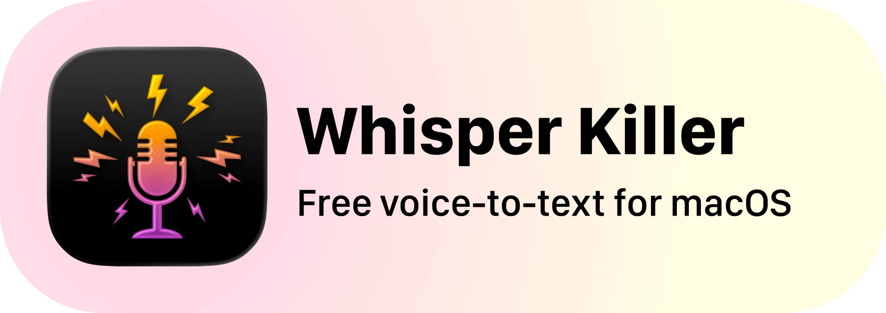
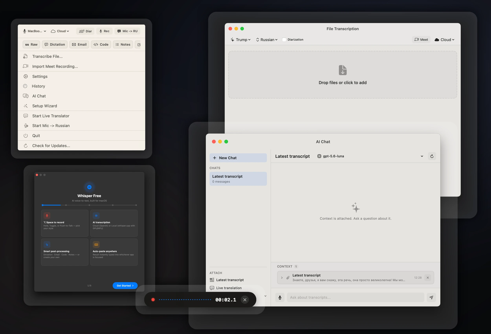

<p align="center">
  
</p>

<h1 align="center">WhisperKiller</h1>

<p align="center">Dictate into your apps, transcribe recordings, and work with your transcripts on macOS.</p>

<p align="center">
  <a href="https://github.com/iddictive/Whisper-Killer/releases/latest">Download for macOS</a> ·
  <a href="#quick-start">Quick start</a> ·
  <a href="#engines">Engines</a> ·
  <a href="CHANGELOG.md">Changelog</a> ·
  <a href="#russian">Русский</a>
</p>

<p align="center">
  <a href="https://github.com/iddictive/Whisper-Killer/releases/latest"></a>
  
</p>

WhisperKiller turns a global shortcut into speech-to-text. Choose local transcription with Whisper, Qwen3-ASR, or Parakeet, or connect your own OpenAI API key for cloud transcription. Drop in audio or video files, clean up the results, and revisit them in searchable history.

<p align="center">
  <a href="assets/interface-collage.webp"></a>
</p>

## Quick start

1. Download the DMG from [Releases](https://github.com/iddictive/Whisper-Killer/releases/latest) and move the app to Applications.
2. Complete setup and grant Microphone and Accessibility permissions.
3. Choose a transcription engine and download its model, or add your OpenAI API key.
4. Press **Option + Space** to dictate, or open file transcription and drop in a recording.

Official install/build scripts target Apple Silicon and macOS 14 or newer. Local models need an initial download; cloud features require an API key and provider usage charges may apply.

## Features

- Dictation from the menu bar with a global shortcut. Default: `Option + Space`.
- Hold-to-record, toggle recording, and push-to-talk modes.
- Audio and video file transcription through a drag-and-drop queue.
- File range trimming before transcription.
- Result insertion into the active app by paste, typing, or paste-and-enter.
- Transcript cleanup modes for dictation, email, code, notes, and custom prompts.
- Speaker diarization and summaries when an OpenAI key is available.
- Searchable history with raw text, processed text, summaries, playback, and Finder reveal.
- Live Translator for microphone or system audio.
- Google Meet recording import from Drive when Google OAuth is configured.
- AI Chat for follow-up questions about transcripts and attached context.

## Engines

| Engine | Use it for | Requirements |
| --- | --- | --- |
| Local Whisper | Offline dictation and file transcription | `brew install whisper-cpp` plus a downloaded Whisper model |
| Qwen3-ASR MLX | Local transcription on Apple Silicon; 0.6B for speed or 1.7B for higher multilingual accuracy | App-managed Python/MLX runtime and a downloaded Qwen3-ASR model |
| Parakeet TDT v3 | Fast offline multilingual transcription through Core ML | Apple Silicon and a one-time ~460 MiB model download |
| OpenAI transcription | Cloud transcription runs | OpenAI API key |
| Ollama follow-up | Local follow-up summaries where configured | Ollama installed locally |

Parakeet integration uses [FluidAudio](https://github.com/FluidInference/FluidAudio) under Apache-2.0. The downloaded [Parakeet TDT v3 Core ML model](https://huggingface.co/FluidInference/parakeet-tdt-0.6b-v3-coreml) is derived from NVIDIA Parakeet and licensed under CC BY 4.0.

## Languages

The app exposes 17 selectable languages plus auto-detect: English, Russian, Spanish, French, German, Italian, Portuguese, Japanese, Korean, Chinese, Arabic, Hindi, Turkish, Polish, Dutch, Swedish, and Ukrainian.

## Build From Source

```bash
git clone https://github.com/iddictive/Whisper-Killer.git
cd Whisper-Killer
make install
```

Useful commands:

```bash
make dev      # persistent local debug app with automatic rebuild + relaunch
make install  # build, install to /Applications, and launch
make verify   # run tests and verify release build
```

`make dev` keeps a separate `WhisperKiller Dev.app` under `.build/dev-runtime`.
Swift and resource changes trigger an incremental debug build and relaunch only
after the new bundle passes code-signing verification. It does not create a DMG,
replace `/Applications/WhisperKiller.app`, or reset macOS permissions.

### Preparing a release

Write user-facing changes under `Unreleased` in `CHANGELOG.md`. When the batch is
ready, run `make release-prepare`: it reads remote release tags, moves those notes to
the next version with a UTC date, and updates both bundle version fields.
Review and commit the changelog and `Info.plist` together, then push to `main`
when publication is intended. Preparation itself does not commit or publish.

CI validates that the version and notes agree, runs tests, and publishes only a
new prepared version. The tag points to that exact commit; the DMG, bundled
changelog, and GitHub release notes use the same version and content. Ordinary
pushes with an already released version run tests without creating another
release. See [the release contract](docs/releases.md) for validation and retries.

## Requirements

- macOS 14 or newer
- Apple Silicon for the official install/build scripts
- 8 GB RAM minimum; 16 GB or more for larger local models
- Accessibility permission for global shortcuts and text insertion
- Microphone permission for dictation

---

<a id="russian"></a>

## Русский

WhisperKiller — диктовка и транскрибация файлов из строки меню macOS. Нажмите **Option + Space**, чтобы превратить речь в текст, или добавьте аудио и видео в очередь транскрибации. Готовую расшифровку можно обработать, вставить в другое приложение и найти в истории.

### Установка

1. Скачайте DMG из [Releases](https://github.com/iddictive/Whisper-Killer/releases/latest) и перенесите приложение в Applications.
2. Пройдите первоначальную настройку и разрешите доступ к микрофону и Универсальному доступу.
3. Выберите локальный движок и загрузите модель либо добавьте ключ OpenAI API.
4. Начните диктовку горячей клавишей или перетащите запись в окно транскрибации файлов.

Официальные скрипты сборки и установки рассчитаны на Apple Silicon и macOS 14 или новее. Для локальных моделей нужна первоначальная загрузка. Облачная обработка использует ваш ключ API и может оплачиваться по тарифам провайдера.

### Возможности

- Запись по удержанию клавиши, переключением или в режиме push-to-talk.
- Очередь аудио и видео с выбором нужного фрагмента перед транскрибацией.
- Вставка результата через буфер обмена, посимвольный ввод или вставку с отправкой.
- Обработка расшифровок для писем, заметок, кода и собственных сценариев.
- История с поиском, исходным и обработанным текстом, воспроизведением и открытием файла.
- Разделение по спикерам и резюме с OpenAI API, перевод аудио и чат по расшифровкам.
- Импорт записей Google Meet из Drive после настройки Google OAuth.

### Выбор движка

**Whisper** работает локально через `whisper.cpp`. **Qwen3-ASR** использует управляемое приложением окружение Python/MLX на Apple Silicon. **Parakeet TDT v3** работает локально через Core ML. **OpenAI** обрабатывает записи в облаке с вашим ключом API. Для локальной обработки результатов можно настроить Ollama.

Требования и лицензии моделей приведены в разделе [Engines](#engines). В настройках доступны 17 языков и автоматическое определение.

### Разработка

```bash
git clone https://github.com/iddictive/Whisper-Killer.git
cd Whisper-Killer
make dev
```

`make dev` запускает отдельное приложение для разработки с пересборкой при изменениях. `make verify` выполняет проверки и release-сборку. `make install` собирает, устанавливает приложение в Applications и запускает его.

История изменений — в [CHANGELOG.md](CHANGELOG.md), порядок подготовки релиза — в [docs/releases.md](docs/releases.md).
